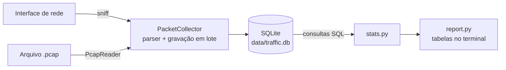

# Analisador de Tráfego de Rede

[](https://github.com/brunodrapalski-hue/Analizador-de-trafego/actions/workflows/ci.yml)

Aplicação em python executada em docker para captura, persistência e análise básica de tráfego de rede.

O projeto foi desenvolvido tendo como requisito principal a captura real de pacotes de uma interface de rede, seguida da extração, armazenamento em banco de dados e geração das estatísticas previstas no desafio. Para manter um ambiente Linux consistente durante o desenvolvimento em Windows, utilizei o WSL2 com Ubuntu 24.04 e o Docker Engine executado dentro desse ambiente. O VS Code foi conectado diretamente ao WSL, e o terminal Linux foi utilizado para Git, Docker e execução da aplicação. O container consegue acessar as interfaces de rede do WSL e realizar a captura ao vivo pela interface informada à aplicação.

Além da captura ao vivo, optei por inclui o processamento de uma amostra `.pcap` como recurso complementar de validação. Ela percorre a mesma cadeia de parsing, persistência e geração de estatísticas utilizada pelos pacotes capturados em tempo real, permitindo reproduzir esse processamento com uma entrada conhecida e comparar os resultados sem depender do tráfego existente naquele momento. Nessa implementação optei por separar a captura, interpretação dos pacotes, persistência, consultas e apresentação dos resultados. As decisões técnicas e as limitações encontradas durante o desenvolvimento documentadas para facilitar a análise e a validação da solução.

Centralizei essa entrega no GitHub, mantendo código, documentação e histórico de alterações no mesmo repositório. Essa organização facilitou os ajustes realizados durante o desenvolvimento e manteve rastreabilidade das mudanças. A documentação foi separada por finalidade: execução e validação, arquitetura, banco de dados, decisões técnicas e evidências, para facilar a consulta e atualização de forma independente.

A partir de repositório, conseguimos entender a estrutura, preparar o ambiente, executar a aplicação, validar seu comportamento e consultar as decisões adotadas.

<br>

## Por onde começar

Passo a passo para preparar o ambiente, executar a aplicação e conferir o resultado de cada comando. Siga as etapas no documento a seguir: **[Guia de execução e validação](docs/validacao.md)**.

<br>

## Atendimento aos requisitos

| Requisito | Como foi atendido |
|---|---|
| Capturar pacotes de uma interface especificada | `capture --iface IFACE`, com Scapy (`sniff`) |
| IP de origem, IP de destino, protocolo e tamanho | Extraídos por `app/parser.py`; o tamanho é o do frame completo |
| Total de pacotes capturados | Resumo: total capturado, pacotes IP armazenados e frames não-IP ignorados |
| Pacotes por protocolo | TCP, UDP, ICMP, ICMPv6 e OTHER, com percentual e bytes |
| Top 5 IPs de origem e de destino | Quatro rankings: origem e destino, por pacotes e por bytes |
| Armazenamento em banco de dados | SQLite (`data/traffic.db`), com as tabelas `capture_sessions` e `packets` |
| Python + Docker | Python 3.13, Dockerfile multi-stage e Docker Compose |
| Documentação e justificativas | Este README e a pasta DOCS |

<br>

## Como funciona



- **Mesmo pipeline:** a captura ao vivo e a leitura de `.pcap` passam pelo mesmo parser, pela mesma gravação e pelas mesmas consultas. O `.pcap` fornece uma entrada reproduzível.
- **Frames não-IP:** frames sem IP (ex.: ARP) não são armazenados, mas entram no total capturado.
- **Gravação:** em lotes (padrão: 100 pacotes por transação). Cada captura gera uma sessão no banco.
- **Payload:** o conteúdo dos pacotes não é gravado.

<br>

## Resultado de referência

| Métrica | Valor |
|---|---:|
| Total de frames capturados | 300 |
| Pacotes IP armazenados | 284 |
| Frames não-IP ignorados (ARP) | 16 |
| Bytes dos pacotes IP | 659.108 |
| TCP / UDP / ICMP | 234 / 30 / 20 |
| 1º IP de origem por pacotes | 172.19.40.48 (146) |
| 1º IP de origem por bytes | 4.228.31.150 (589.329) |
| 1º IP de destino por pacotes | 172.19.40.48 (116) |

As contagens principais da amostra são verificadas por testes automatizados. Os rankings completos e a conferência no Wireshark estão no [Guia de validação](docs/validacao.md).

<br>

## Referência de comandos

| Comando | Função |
|---|---|
| `capture --iface IFACE` | Captura ao vivo de uma interface |
| `capture --pcap ARQUIVO` | Lê um arquivo `.pcap` |
| `sessions` | Lista as sessões de captura gravadas |
| `stats [--session N]` | Estatísticas de uma sessão ou de todas, sem nova captura |

Todos os comandos são executados com `docker compose run --rm analyzer <comando>`.

<br>

| Opção (só captura ao vivo) | Função |
|---|---|
| `-c`, `--count N` | Para após N frames que passarem pelo filtro (IP ou não-IP) |
| `-t`, `--duration N` | Para após N segundos |
| `-f`, `--filter EXPR` | Filtro BPF, com a mesma sintaxe do tcpdump (ex.: `"tcp or udp"`) |


| Variável de ambiente | Padrão | Função |
|---|---|---|
| `TRAFFIC_DB_PATH` | `data/traffic.db` | Arquivo do banco |
| `TRAFFIC_BATCH_SIZE` | `100` | Pacotes por transação de gravação |

O banco fica em `./data` (volume) e persiste entre execuções. Uma interface inexistente gera um erro que lista as interfaces disponíveis.

<br>

## Qualidade

```bash
docker compose run --rm -T --build quality
```

Esse comando executa, na sua máquina, a mesma verificação de qualidade usada no CI. Ela roda dentro de uma imagem de testes, separada da imagem de execução, e passa por quatro ferramentas, nesta ordem:


| Ferramenta | O que verifica |
|---|---|
| ruff | Padrões de código (lint) e formatação |
| pytest | 41 testes automatizados, incluindo a validação com `samples/demo.pcap` |
| bandit | Padrões inseguros no código (análise estática de segurança) |
| pip-audit | Vulnerabilidades conhecidas nas dependências Python |

- **Falhas:** se uma etapa falhar, o comando para e retorna erro.
- **Opções:** `--build` reconstrói a imagem de testes com o código atual, e `-T` permite rodar sem terminal interativo, como no CI.
- **Resultado atual:** todas as verificações aprovadas ([relatório](docs/security/quality-report.txt)).

No GitHub Actions, o CI executa o mesmo comando a cada push na `main` e em pull requests. Em seguida, faz o build da imagem de execução e a analisa com Trivy. O build falha se houver vulnerabilidade CRITICAL com correção disponível. Os achados HIGH do sistema base ficam registrados em [relatório](docs/security/trivy-report.txt).

<br>

## Privilégios e uso responsável

- A captura deve ser feita apenas em redes e equipamentos para os quais há autorização.
- Apenas metadados são gravados: horário, versão IP, IPs, protocolo e tamanho do frame.
- O container usa `network_mode: host` para enxergar as interfaces do host e declara `NET_RAW` para abrir sockets brutos. Não usa `privileged` e não adiciona `NET_ADMIN`.
- O processo roda como root dentro do container, com o conjunto padrão de capabilities do Docker.

<br>

## Desenvolvimento

- **Ambiente:** Windows 11 com WSL2 (Ubuntu 24.04) e Docker Engine, editando pelo VS Code conectado ao WSL. Ambiente descrito.
- **Versionamento:** Git e GitHub, com commits por etapas.

<br>

## Acerca de limitações

- IPv6 com cabeçalhos de extensão é classificado pelo primeiro cabeçalho (ex.: Hop-by-Hop aparece como `OTHER`).
- O SQLite atende a um processo gravando por vez. Para vários sensores simultâneos, a evolução seria PostgreSQL, com adaptação da persistência e das consultas.
- Os resultados da captura ao vivo dependem da interface e do tráfego do ambiente.
- No WSL2, a captura vê o tráfego do próprio WSL, não o de todo o Windows.

<br>

## Acerca da documentação

| Documento | Conteúdo |
|---|---|
| [docs/validacao.md](docs/validacao.md) | Passo a passo: preparação do ambiente (Windows/WSL2 ou Linux), execução, resultados esperados, erros, testes, troubleshooting |
| [docs/arquitetura.md](docs/arquitetura.md) | Como funciona: módulos, fluxo do pacote, sequência, imagens Docker |
| [docs/banco-de-dados.md](docs/banco-de-dados.md) | Schema, modelo ER, integridade e consultas |
| [docs/decisoes.md](docs/decisoes.md) | Por que cada escolha foi feita e o custo aceito |
| [docs/evidencias/](docs/evidencias/) | Saídas reais: amostra, sessões, captura ao vivo, erro de interface |
