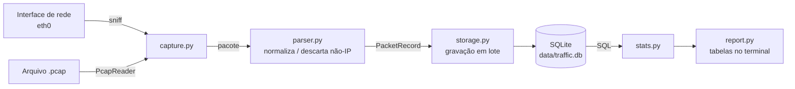

# Analisador de Tráfego de Rede

[](https://github.com/brunodrapalski-hue/Analizador-de-trafego/actions/workflows/ci.yml)

Aplicação que **captura pacotes de uma interface de rede**, grava os metadados em um **banco de dados SQLite** e exibe **estatísticas de tráfego**, executando inteiramente em **Docker**.

| Requisito do desafio | Como é atendido |
|---|---|
| Capturar pacotes de uma interface especificada | `capture --iface eth0` (Scapy) |
| Campos: IP de origem, IP de destino, protocolo, tamanho | Extraídos por `app/parser.py` |
| Total de pacotes, pacotes por protocolo | Comando `stats` |
| Top 5 IPs de origem e de destino com mais tráfego | Comando `stats` — por **pacotes** e por **bytes** |
| Armazenamento em banco de dados | SQLite (`data/traffic.db`), schema em [docs/banco-de-dados.md](docs/banco-de-dados.md) |
| Python + Docker | Python 3.13, Docker Compose |

A rastreabilidade completa (requisito → código → teste → evidência) está em [docs/rastreabilidade.md](docs/rastreabilidade.md).

---

## Execução rápida

Pré-requisito único: **Docker com Docker Compose em Linux** (ou WSL2 no Windows). Não é necessário instalar Python.

```bash
git clone https://github.com/brunodrapalski-hue/Analizador-de-trafego.git
cd Analizador-de-trafego
docker compose build

# 1. Análise do arquivo de amostra incluído
docker compose run --rm analyzer capture --pcap samples/demo.pcap

# 2. Captura ao vivo: 30 segundos da interface eth0 (IP ou não-IP)
# Substitua eth0 pela interface disponível no ambiente, se necessário.
docker compose run --rm analyzer capture --iface eth0 --duration 30
```

Resultado esperado para a amostra `samples/demo.pcap` (300 pacotes):

| Métrica | Valor |
|---|---|
| Pacotes IP armazenados | 284 |
| Pacotes não-IP ignorados (ex.: ARP) | 16 |
| TCP / UDP / ICMP | 234 (82,4%) / 30 (10,6%) / 20 (7,0%) |
| Top 1 IP de origem (pacotes) | 172.19.40.48 — 146 pacotes |
| Top 1 IP de origem (bytes) | 4.228.31.150 — 589.329 bytes |
| Top 1 IP de destino (pacotes) | 172.19.40.48 — 116 pacotes |

Os números foram conferidos de forma independente e são verificados por testes automatizados. A saída completa está em [docs/evidencias/](docs/evidencias/).

---

## Uso

```text
traffic-analyzer [--db DB] {capture,stats,sessions}
```

| Comando | Descrição |
|---|---|
| `capture --iface IFACE` | Captura ao vivo de uma interface de rede |
| `capture --pcap ARQUIVO` | Lê um arquivo `.pcap` (mesmo pipeline da captura ao vivo) |
| `stats [--session N]` | Estatísticas de uma sessão ou de todas |
| `sessions` | Lista as sessões de captura registradas |

Opções da captura ao vivo:

| Opção | Descrição | Exemplo |
|---|---|---|
| `-c`, `--count` | Para após N frames recebidos após o filtro, inclusive não-IP (padrão: ilimitado) | `--count 500` |
| `-t`, `--duration` | Para após N segundos | `--duration 60` |
| `-f`, `--filter` | Filtro BPF (mesma sintaxe do tcpdump/Wireshark) | `--filter "tcp or udp"` |

A captura também pode ser encerrada com **Ctrl+C**: os pacotes já coletados são gravados e a sessão é fechada normalmente. Ao final de toda captura, as estatísticas da sessão são exibidas automaticamente.

Exemplos:

```bash
docker compose run --rm analyzer capture --iface eth0 --duration 60 --filter "tcp or udp"
docker compose run --rm analyzer sessions
docker compose run --rm analyzer stats --session 1
docker compose run --rm analyzer stats
```

### Configuração

| Variável de ambiente | Padrão | Descrição |
|---|---|---|
| `TRAFFIC_DB_PATH` | `data/traffic.db` | Arquivo do banco SQLite |
| `TRAFFIC_BATCH_SIZE` | `100` | Pacotes por transação de gravação |

O banco fica na pasta `data/` do projeto (volume Docker) e persiste entre execuções.

### Interfaces disponíveis

Informar uma interface inexistente exibe a lista das disponíveis:

```bash
docker compose run --rm analyzer capture --iface eth9
# ERROR: Interface 'eth9' not found. Available: lo, eth0, docker0, ...
```

> **Windows:** execute a partir do WSL2. O Docker Desktop no Windows não tem acesso às placas de rede físicas; dentro do WSL2 a captura ocorre na interface virtual `eth0`, que recebe o tráfego gerado no próprio WSL. O modo `--pcap` funciona em qualquer ambiente.

---

## Arquitetura em resumo



Detalhes em [docs/arquitetura.md](docs/arquitetura.md).

---

## Qualidade e segurança

```bash
docker compose run --rm -T --build quality   # lint, formatação, testes, SAST e auditoria de dependências
docker compose run --rm --build tests     # somente os testes
```

| Verificação | Ferramenta | Resultado |
|---|---|---|
| Testes automatizados | pytest | 41 testes, incluindo validação com o `demo.pcap` |
| Estilo e padrões inseguros | ruff | sem apontamentos |
| Análise estática de segurança (SAST) | bandit | 0 problemas |
| Vulnerabilidades em dependências | pip-audit | nenhuma conhecida |
| Vulnerabilidades na imagem | Trivy | 0 críticas; achados residuais documentados |

Tudo roda automaticamente no GitHub Actions a cada push. Controles de segurança, privacidade (LGPD) e o registro de aceite de risco estão em [docs/seguranca.md](docs/seguranca.md).

> **Uso responsável:** capture tráfego apenas em redes e equipamentos para os quais você tem autorização. A aplicação grava somente metadados (IPs, protocolo, tamanho e horário) — nunca o conteúdo dos pacotes.

---

## Estrutura do projeto

```text
.
├── app/                   # código da aplicação
│   ├── __main__.py        # ponto de entrada (python -m app)
│   ├── cli.py             # comandos e argumentos
│   ├── config.py          # configurações por variável de ambiente
│   ├── capture.py         # captura ao vivo e leitura de pcap
│   ├── parser.py          # pacote → registro normalizado
│   ├── storage.py         # schema e gravação no SQLite
│   ├── stats.py           # estatísticas via SQL
│   └── report.py          # exibição em tabelas (rich)
├── tests/                 # testes automatizados (pytest)
├── samples/demo.pcap      # amostra de tráfego controlado
├── scripts/check.sh       # portão de qualidade e segurança
├── docs/                  # documentação técnica e evidências
├── .github/workflows/     # pipeline de CI
├── Dockerfile             # imagens runtime e test (multi-stage)
└── docker-compose.yml     # serviços analyzer, tests e quality
```

## Documentação

| Documento | Conteúdo |
|---|---|
| [docs/arquitetura.md](docs/arquitetura.md) | Componentes, fluxo de dados, sequência, implantação |
| [docs/banco-de-dados.md](docs/banco-de-dados.md) | Schema, diagrama ER, índices, integridade, consultas |
| [docs/decisoes.md](docs/decisoes.md) | Decisões técnicas e justificativas (D1 a D12) |
| [docs/seguranca.md](docs/seguranca.md) | Controles, privacidade, modelo de ameaças, aceite de risco |
| [docs/rastreabilidade.md](docs/rastreabilidade.md) | Requisito → implementação → verificação → evidência |

## Limitações conhecidas

- IPv6 com cabeçalhos de extensão é classificado pelo primeiro cabeçalho (ex.: Hop-by-Hop aparece como `OTHER`).
- SQLite atende bem ao cenário local de um capturador por vez; para múltiplos sensores simultâneos, PostgreSQL é uma evolução possível. Essa mudança exigiria adaptar a persistência em `storage.py` e as consultas SQL em `stats.py`.
- O container executa como root e não utiliza `privileged` nem adiciona `NET_ADMIN`. A capability `NET_RAW` é declarada explicitamente no Docker Compose para a captura de pacotes (ver [docs/seguranca.md](docs/seguranca.md)).
