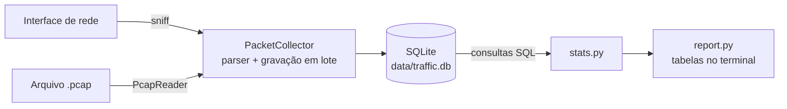

# Analisador de Tráfego de Rede

[](https://github.com/brunodrapalski-hue/Analizador-de-trafego/actions/workflows/ci.yml)

Aplicação em Python, executada em Docker, que:

- captura pacotes de uma interface de rede (ou lê um arquivo `.pcap`);
- grava os metadados em SQLite;
- exibe estatísticas de tráfego no terminal.

## Requisitos do desafio

| Requisito | Como é atendido |
|---|---|
| Capturar pacotes de uma interface especificada | `capture --iface IFACE`, com Scapy (`sniff`) |
| IP de origem, IP de destino, protocolo e tamanho | Extraídos por `app/parser.py`; o tamanho é o do frame completo |
| Total de pacotes capturados | Resumo: total capturado, pacotes IP armazenados e frames não-IP ignorados |
| Pacotes por protocolo | TCP, UDP, ICMP, ICMPv6 e OTHER, com percentual e bytes |
| Top 5 IPs de origem e de destino | Quatro rankings: origem e destino, por pacotes e por bytes |
| Armazenamento em banco de dados | SQLite (`data/traffic.db`), com tabelas `capture_sessions` e `packets` |
| Python + Docker | Python 3.13, Dockerfile multi-stage e Docker Compose |
| Documentação e justificativas | Este README e a pasta [docs/](#documentação) |

## Como funciona



- **Mesmo pipeline:** a captura ao vivo e a leitura de `.pcap` passam pelo mesmo parser, pela mesma gravação e pelas mesmas consultas. O `.pcap` fornece uma entrada reproduzível.
- **Frames não-IP:** frames sem IP (ex.: ARP) não são armazenados, mas entram no total capturado.
- **Gravação:** em lotes (padrão: 100 pacotes por transação). Cada captura gera uma sessão no banco.
- **Payload:** o conteúdo dos pacotes não é gravado.

## Execução rápida

Pré-requisitos: Git, Docker e Docker Compose em Linux ou no WSL2 (no Windows, execute dentro do WSL2). Não é necessário instalar Python.

```bash
git clone https://github.com/brunodrapalski-hue/Analizador-de-trafego.git
cd Analizador-de-trafego
docker compose build

# 1. Amostra reproduzível incluída no projeto
docker compose run --rm analyzer capture --pcap samples/demo.pcap

# 2. Captura ao vivo por 30 segundos (confira o nome da interface com: ip -br link)
docker compose run --rm analyzer capture --iface eth0 --duration 30
```

Durante a captura ao vivo, gere tráfego em outro terminal (ex.: `ping -c 10 1.1.1.1`). Sem `--duration` ou `--count`, a captura continua até Ctrl+C; os pacotes coletados são gravados e o relatório é exibido.

## Resultado de referência — `samples/demo.pcap`

| Métrica | Valor |
|---|---:|
| Total de frames capturados | 300 |
| Pacotes IP armazenados | 284 |
| Frames não-IP ignorados (ARP) | 16 |
| Bytes dos pacotes IP | 659.108 |
| TCP / UDP / ICMP | 234 / 30 / 20 |
| 1º IP de origem por pacotes | 172.19.40.48 (146) |
| 1º IP de origem por bytes | 4.228.31.150 (589.329) |
| 1º IP de destino por pacotes | 172.19.40.48 (116) |

As contagens principais da amostra são verificadas por testes automatizados. Os rankings completos e a conferência no Wireshark estão no [guia de validação](docs/validacao.md#2-pcap-de-referência).

## Uso

Todos os comandos são executados com `docker compose run --rm analyzer <comando>`.

| Comando | Função |
|---|---|
| `capture --iface IFACE` | Captura ao vivo de uma interface |
| `capture --pcap ARQUIVO` | Lê um arquivo `.pcap` |
| `sessions` | Lista as sessões de captura gravadas |
| `stats [--session N]` | Estatísticas de uma sessão ou de todas, sem nova captura |

| Opção (só captura ao vivo) | Função |
|---|---|
| `-c`, `--count N` | Para após N frames que passarem pelo filtro (IP ou não-IP) |
| `-t`, `--duration N` | Para após N segundos |
| `-f`, `--filter EXPR` | Filtro BPF, mesma sintaxe do tcpdump (ex.: `"tcp or udp"`) |

| Variável de ambiente | Padrão | Função |
|---|---|---|
| `TRAFFIC_DB_PATH` | `data/traffic.db` | Arquivo do banco |
| `TRAFFIC_BATCH_SIZE` | `100` | Pacotes por transação de gravação |

O banco fica em `./data` (volume) e persiste entre execuções. Uma interface inexistente gera um erro que lista as interfaces disponíveis.

## Qualidade

```bash
docker compose run --rm -T --build quality
```

O comando roda, em sequência: ruff (lint e formatação), pytest (41 testes), bandit e pip-audit. O resultado atual é tudo aprovado ([relatório](docs/security/quality-report.txt)). O CI no GitHub Actions executa o mesmo gate a cada push na `main` e em pull requests, faz o build da imagem e a analisa com Trivy. O build falha se houver vulnerabilidade CRITICAL com correção disponível; os achados HIGH do sistema base são registrados em relatório.

## Privilégios e uso responsável

- A captura deve ser feita apenas em redes e equipamentos para os quais há autorização.
- Apenas metadados são gravados: horário, versão IP, IPs, protocolo e tamanho do frame.
- O container usa `network_mode: host` para enxergar as interfaces do host e declara `NET_RAW` para abrir sockets brutos. Não usa `privileged` e não adiciona `NET_ADMIN`.
- O processo roda como root dentro do container, com o conjunto padrão de capabilities do Docker.

## Limitações

- IPv6 com cabeçalhos de extensão é classificado pelo primeiro cabeçalho (ex.: Hop-by-Hop aparece como `OTHER`).
- O SQLite atende a um processo gravando por vez. Para vários sensores simultâneos, a evolução seria PostgreSQL, com adaptação da persistência e das consultas.
- Os resultados da captura ao vivo dependem da interface e do tráfego do ambiente.
- No WSL2, a captura vê o tráfego do próprio WSL, não o de todo o Windows.

## Documentação

| Documento | Conteúdo |
|---|---|
| [docs/validacao.md](docs/validacao.md) | Como reproduzir e validar: valores esperados, captura ao vivo, erros, testes, troubleshooting |
| [docs/arquitetura.md](docs/arquitetura.md) | Como funciona: módulos, fluxo do pacote, sequência, imagens Docker |
| [docs/banco-de-dados.md](docs/banco-de-dados.md) | Schema, modelo ER, integridade e consultas |
| [docs/decisoes.md](docs/decisoes.md) | Por que cada escolha foi feita e o custo aceito |
| [docs/evidencias/](docs/evidencias/) | Saídas reais: amostra, sessões, captura ao vivo, erro de interface |
