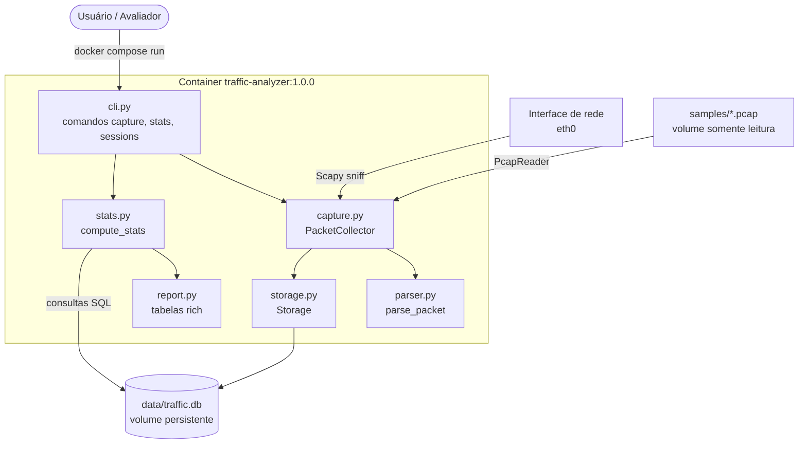
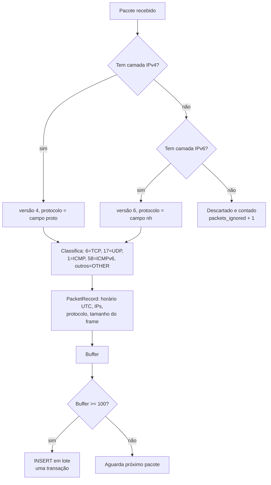
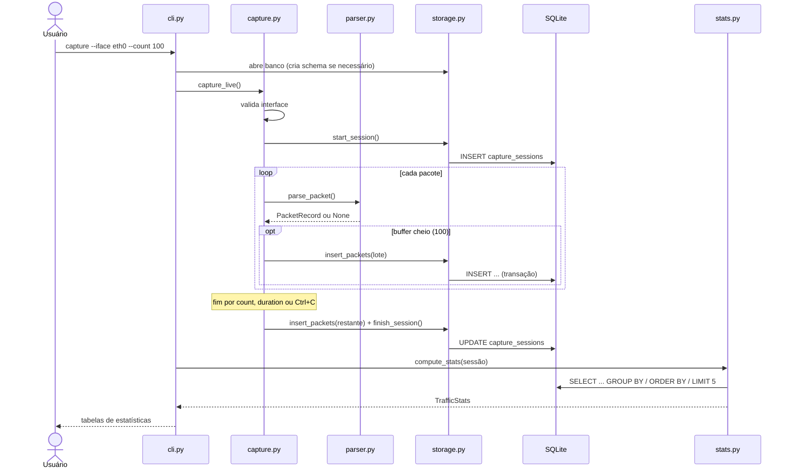
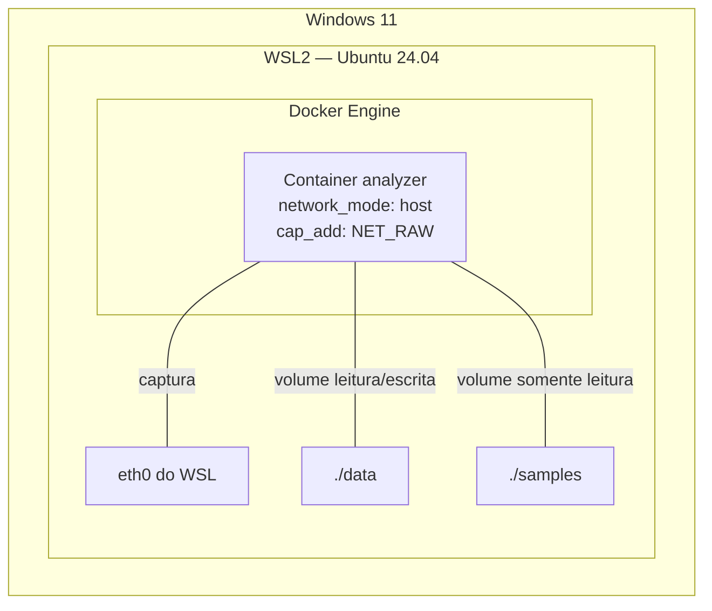

# Arquitetura

## Visão geral

A aplicação é uma ferramenta de linha de comando empacotada em Docker. Ela recebe pacotes de duas fontes possíveis — uma interface de rede ou um arquivo `.pcap` — e processa ambas pelo **mesmo pipeline**: normalização, gravação em lote no SQLite e cálculo de estatísticas via SQL.

## Responsabilidade de cada módulo

| Módulo | Responsabilidade | Não faz |
|---|---|---|
| `cli.py` | Interpreta comandos e argumentos, trata erros e define o código de saída | Não acessa pacotes nem SQL diretamente |
| `capture.py` | Obtém pacotes (ao vivo ou arquivo), aplica o lote e fecha a sessão | Não conhece o formato do banco |
| `parser.py` | Converte um pacote Scapy em `PacketRecord` imutável ou o descarta | Não grava nada |
| `storage.py` | Cria o schema, registra sessões e insere pacotes em transações | Não calcula estatísticas |
| `stats.py` | Calcula as estatísticas com consultas SQL parametrizadas | Não formata saída |
| `report.py` | Exibe estatísticas e sessões em tabelas | Não consulta o banco |
| `config.py` | Centraliza configurações com valores padrão e variáveis de ambiente | — |

A separação permite testar cada parte isoladamente e trocar uma camada sem afetar as demais (ex.: SQLite → PostgreSQL em `storage.py`, terminal → JSON em `report.py`).

## Fluxo de um pacote

## Sequência de uma captura

## Implantação

| Item | Configuração | Motivo |
|---|---|---|
| Rede | `network_mode: host` | O container enxerga as interfaces reais do host para capturar |
| Privilégios | `cap_add: NET_RAW` | Capacidade necessária para sockets brutos; sem `NET_ADMIN` e sem `privileged` |
| Dados | `./data:/app/data` | O banco persiste entre execuções |
| Amostras | `./samples:/app/samples:ro` | Leitura de `.pcap` sem permissão de escrita |

## Imagens Docker (multi-stage)

| Estágio | Imagem | Conteúdo | Uso |
|---|---|---|---|
| `base` | — | Python 3.13 slim, tcpdump/libpcap, scapy, rich, código | Base comum |
| `test` | `traffic-analyzer-tests:1.0.0` | base + pytest, ruff, bandit, pip-audit, testes, amostra | Testes e portão de qualidade |
| `runtime` | `traffic-analyzer:1.0.0` | base **sem o pip** | Execução da aplicação |

A imagem de execução não contém ferramentas de teste nem o instalador de pacotes, reduzindo a superfície de ataque (ver [seguranca.md](seguranca.md)).
