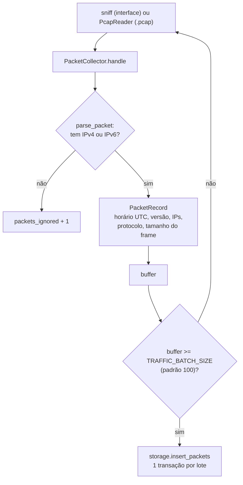
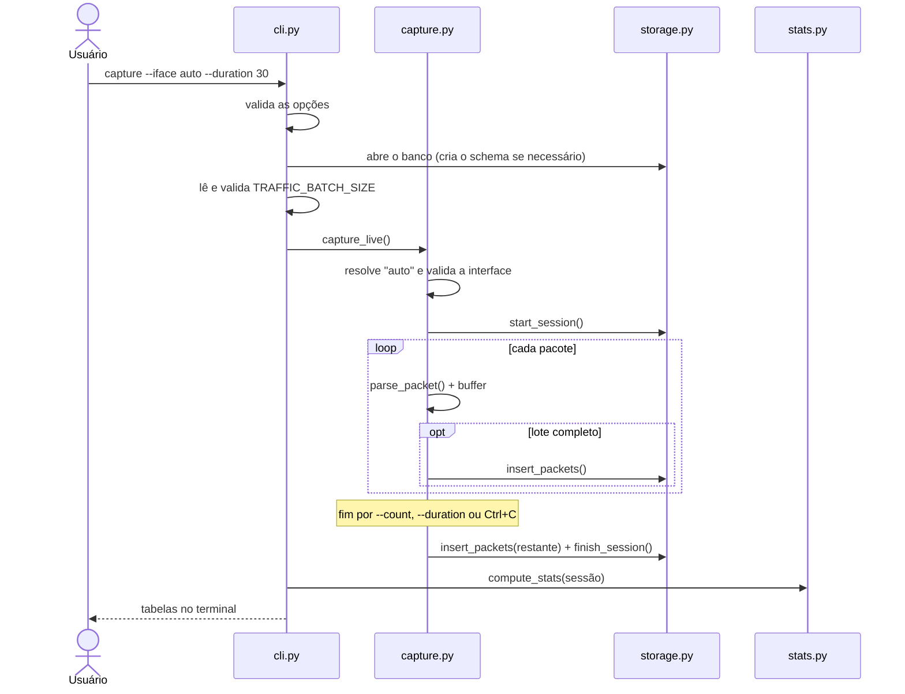

# Arquitetura

A aplicação é uma CLI em Python executada em Docker. Ela recebe pacotes de uma interface de rede (`sniff`) ou de um arquivo `.pcap` (`PcapReader`). As duas fontes entregam cada pacote ao mesmo `PacketCollector`, e a partir dele o processamento é idêntico: normalização, gravação em lote no SQLite e estatísticas calculadas por SQL.

## Módulos

| Módulo | Responsabilidade | Não faz |
|---|---|---|
| `cli.py` | Interpreta comandos e opções, valida combinações, trata erros e define o código de saída | Não interpreta pacotes nem escreve SQL |
| `config.py` | Lê `TRAFFIC_DB_PATH` e `TRAFFIC_BATCH_SIZE` (com validação) | — |
| `capture.py` | Resolve a interface (`auto` = rota padrão), obtém os pacotes (ao vivo ou de arquivo) e, via `PacketCollector`, acumula, grava em lotes e fecha a sessão | Não conhece o schema |
| `parser.py` | Converte um pacote Scapy em `PacketRecord` imutável, ou retorna `None` se não for IP | Não grava nada |
| `storage.py` | Cria o schema, registra sessões e insere lotes em transações | Não calcula estatísticas |
| `stats.py` | Calcula totais, protocolos e rankings com consultas SQL parametrizadas | Não formata a saída |
| `report.py` | Exibe estatísticas e sessões em tabelas (`rich`) | Não acessa o banco |

## Fluxo de um pacote

- **Protocolo:** vem do campo `proto` (IPv4) ou `nh` (IPv6): 6 = TCP, 17 = UDP, 1 = ICMP, 58 = ICMPv6, e qualquer outro valor = `OTHER`.
- **Tamanho:** é o do frame completo. Em arquivos `.pcap`, usa `wirelen`, o tamanho original mesmo se a captura foi truncada.

## Sequência de uma captura

## Encerramento da captura

- **Fim normal:** o `sniff` do Scapy retorna quando atinge `--count`, `--duration` ou recebe Ctrl+C. O Scapy trata o Ctrl+C internamente.
- **Gravação garantida:** em seguida, o `finally` de `capture_live` chama `PacketCollector.finish()`, que grava o lote pendente e registra o fim e os contadores da sessão. O mesmo `finally` existe em `read_pcap`.
- **Validações antes da sessão:** interface inexistente ou não detectada (`auto`), arquivo ausente, `TRAFFIC_BATCH_SIZE` inválido e opções ao vivo usadas com `--pcap` são rejeitados antes de a sessão ser criada.
- **Erros depois da sessão:** um filtro BPF inválido, ou um arquivo que não é pcap, gera erro depois que a sessão foi criada. A sessão fica registrada com 0 pacotes.

## Execução em Docker

| Estágio | Imagem | Conteúdo | Uso |
|---|---|---|---|
| `base` | — | `python:3.13-slim`, tcpdump (fornece a libpcap para os filtros BPF), scapy, rich, `app/` | Base comum |
| `test` | `traffic-analyzer-tests:1.0.0` | base + ferramentas de qualidade, `tests/`, `samples/`, `scripts/` | Serviços `tests` e `quality` |
| `runtime` | `traffic-analyzer:1.0.0` | base sem o pip | Serviço `analyzer` |

| Configuração (`docker-compose.yml`) | Motivo |
|---|---|
| `network_mode: host` | O container enxerga as interfaces do host. Sem isso, veria apenas a própria interface virtual. |
| `cap_add: [NET_RAW]` | Declara explicitamente a capability de socket bruto usada na captura. Sem `privileged`, sem `NET_ADMIN`. |
| `./data:/app/data` | O banco persiste entre execuções (`docker compose run --rm` remove só o container). |
| `./samples:/app/samples:ro` | Os arquivos `.pcap` são lidos sem permissão de escrita. |

As justificativas estão em [decisoes.md](decisoes.md).
