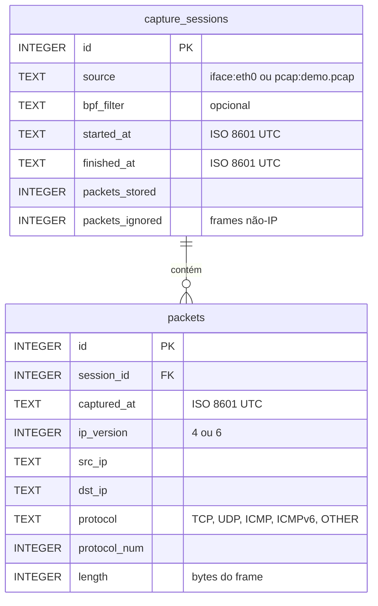

# Banco de dados

## Escolha: SQLite

O desafio exige persistência em banco de dados, sem definir a tecnologia. O SQLite atende sem servidor, usuário ou senha: o banco é um arquivo (`data/traffic.db`) em um volume Docker. Ele também oferece SQL, transações, chaves estrangeiras e restrições `CHECK`.

O limite é a concorrência: o SQLite suporta um processo gravando por vez. Para vários sensores capturando ao mesmo tempo, PostgreSQL seria a evolução natural. A troca exigiria adaptar `app/storage.py` e as consultas de `app/stats.py`; o fluxo de captura continuaria o mesmo.

## Modelo



## Schema

Criado automaticamente na primeira execução (`CREATE ... IF NOT EXISTS`) e preservado nas seguintes. Fonte: `SCHEMA` em `app/storage.py`.

```sql
CREATE TABLE IF NOT EXISTS capture_sessions (
    id              INTEGER PRIMARY KEY AUTOINCREMENT,
    source          TEXT    NOT NULL,
    bpf_filter      TEXT,
    started_at      TEXT    NOT NULL,
    finished_at     TEXT,
    packets_stored  INTEGER NOT NULL DEFAULT 0,
    packets_ignored INTEGER NOT NULL DEFAULT 0
);

CREATE TABLE IF NOT EXISTS packets (
    id           INTEGER PRIMARY KEY AUTOINCREMENT,
    session_id   INTEGER NOT NULL REFERENCES capture_sessions(id),
    captured_at  TEXT    NOT NULL,
    ip_version   INTEGER NOT NULL CHECK (ip_version IN (4, 6)),
    src_ip       TEXT    NOT NULL,
    dst_ip       TEXT    NOT NULL,
    protocol     TEXT    NOT NULL,
    protocol_num INTEGER NOT NULL,
    length       INTEGER NOT NULL CHECK (length >= 0)
);

CREATE INDEX IF NOT EXISTS idx_packets_session  ON packets(session_id);
CREATE INDEX IF NOT EXISTS idx_packets_protocol ON packets(protocol);
CREATE INDEX IF NOT EXISTS idx_packets_src_ip   ON packets(src_ip);
CREATE INDEX IF NOT EXISTS idx_packets_dst_ip   ON packets(dst_ip);
```

## Por que este modelo

| Elemento | Motivo |
|---|---|
| Tabela `capture_sessions` | Cada captura fica registrada com origem, filtro, início, fim e contadores. Permite estatísticas por sessão ou de todas as sessões. |
| `packets_ignored` | Frames não-IP (ex.: ARP) não têm os campos pedidos e não viram linha em `packets`, mas são contados na sessão. |
| `protocol` + `protocol_num` | O nome facilita a leitura; o número preserva a informação quando o protocolo é classificado como `OTHER`. |
| `ip_version` | Distingue IPv4 de IPv6 sem interpretar o texto do endereço. |
| `length` | Tamanho do frame completo, o mesmo critério da coluna *Length* do Wireshark. |
| Datas ISO 8601 em UTC | Texto ordenável e sem ambiguidade de fuso. |
| Sem payload | Só os metadados necessários para as estatísticas são gravados. |

## Integridade

| Controle | Efeito |
|---|---|
| `REFERENCES` + `PRAGMA foreign_keys = ON` | Um pacote não pode existir sem sessão. O SQLite exige ativar a verificação a cada conexão, e `Storage` faz isso (teste: `test_packet_requires_existing_session`). |
| `CHECK` e `NOT NULL` | Rejeitam versão IP inválida, tamanho negativo e campos obrigatórios vazios. |
| Transação por lote | `insert_packets` grava o lote inteiro ou nenhuma linha dele. |

Se o processo for encerrado por sinal (ex.: `kill`, `kill -9` ou `docker stop`), e não por Ctrl+C, `--count` ou `--duration`, a sessão fica sem `finished_at` e o lote que ainda estava em memória se perde. Os lotes já gravados permanecem no banco.

## Consultas das estatísticas

Todas as consultas estão em `app/stats.py`. São estáticas e parametrizadas, sem montar SQL a partir de texto. O filtro `(? IS NULL OR session_id = ?)` permite usar a mesma consulta para uma sessão ou para todas.

```sql
-- Total de pacotes IP e bytes
SELECT COUNT(*), COALESCE(SUM(length), 0)
FROM packets WHERE (? IS NULL OR session_id = ?);

-- Frames não-IP (vêm do contador da sessão)
SELECT COALESCE(SUM(packets_ignored), 0)
FROM capture_sessions WHERE (? IS NULL OR id = ?);

-- Pacotes por protocolo
SELECT protocol, COUNT(*) AS packets, SUM(length) AS bytes
FROM packets WHERE (? IS NULL OR session_id = ?)
GROUP BY protocol ORDER BY packets DESC, protocol;

-- Top 5 origens por pacotes (destino e ordenação por bytes são análogos)
SELECT src_ip, COUNT(*) AS packets, SUM(length) AS bytes
FROM packets WHERE (? IS NULL OR session_id = ?)
GROUP BY src_ip ORDER BY packets DESC, bytes DESC, src_ip LIMIT 5;
```

O resumo exibido soma as duas fontes: **total capturado = pacotes IP + frames não-IP**.

O desempate (bytes, depois o IP) torna o ranking determinístico. Na amostra, `142.251.155.119` e `108.158.137.57` empatam com 18 pacotes como destino, e o primeiro fica à frente por ter mais bytes.

## Índices

Os índices seguem as colunas de filtro e agrupamento. Na prática, o planner do SQLite usa os de `protocol`, `src_ip` e `dst_ip` para percorrer os dados já ordenados no `GROUP BY`. O de `session_id` não é aproveitado por essas consultas, porque a condição `(? IS NULL OR ...)` impede isso. Para verificar:

```sql
EXPLAIN QUERY PLAN SELECT COUNT(*), SUM(length) FROM packets WHERE (1 IS NULL OR session_id = 1);
-- SCAN packets
EXPLAIN QUERY PLAN SELECT COUNT(*), SUM(length) FROM packets WHERE session_id = 1;
-- SEARCH packets USING INDEX idx_packets_session (session_id=?)
```

No volume deste projeto, o efeito no tempo de resposta é desprezível. Se o banco crescer muito, a alternativa é ter uma versão de cada consulta com `WHERE session_id = ?`.

## Consultar o banco manualmente

`data/traffic.db` pode ser aberto com qualquer cliente SQLite, como o `sqlite3` ou o DB Browser for SQLite. Abra em modo somente leitura enquanto houver uma captura em andamento.
