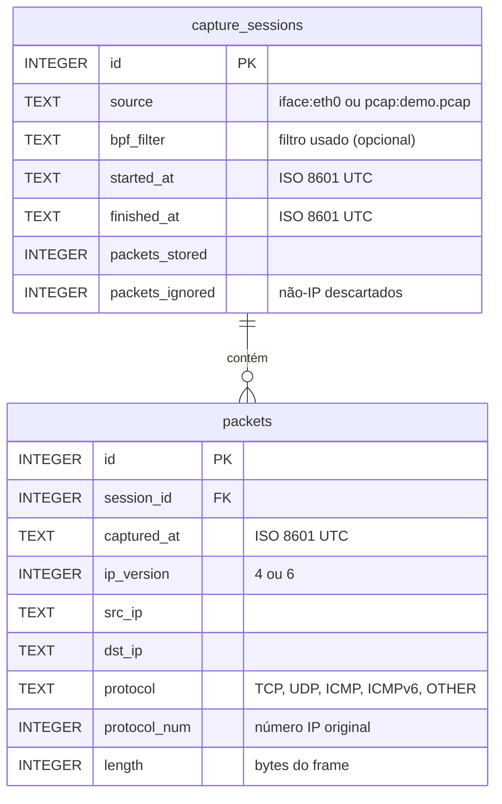

# Banco de dados

## Escolha: SQLite

O desafio pede o armazenamento em "um banco de dados". O SQLite foi escolhido porque:

- é um arquivo único, sem servidor, senha ou container adicional — o avaliador executa com um comando;
- oferece SQL completo, transações ACID, chaves estrangeiras e restrições `CHECK`;
- atende ao cenário de uma ferramenta de análise local com um único processo gravando.

**Evolução prevista:** para vários sensores capturando ao mesmo tempo ou acesso remoto concorrente, o caminho é PostgreSQL. Toda a persistência está isolada em `app/storage.py`, então a troca não afeta captura nem estatísticas.

## Diagrama ER



## Schema (DDL)

```sql
CREATE TABLE IF NOT EXISTS capture_sessions (
    id              INTEGER PRIMARY KEY AUTOINCREMENT,
    source          TEXT    NOT NULL,
    bpf_filter      TEXT,
    started_at      TEXT    NOT NULL,
    finished_at     TEXT,
    packets_stored  INTEGER NOT NULL DEFAULT 0,
    packets_ignored INTEGER NOT NULL DEFAULT 0
);

CREATE TABLE IF NOT EXISTS packets (
    id           INTEGER PRIMARY KEY AUTOINCREMENT,
    session_id   INTEGER NOT NULL REFERENCES capture_sessions(id),
    captured_at  TEXT    NOT NULL,
    ip_version   INTEGER NOT NULL CHECK (ip_version IN (4, 6)),
    src_ip       TEXT    NOT NULL,
    dst_ip       TEXT    NOT NULL,
    protocol     TEXT    NOT NULL,
    protocol_num INTEGER NOT NULL,
    length       INTEGER NOT NULL CHECK (length >= 0)
);

CREATE INDEX IF NOT EXISTS idx_packets_session  ON packets(session_id);
CREATE INDEX IF NOT EXISTS idx_packets_protocol ON packets(protocol);
CREATE INDEX IF NOT EXISTS idx_packets_src_ip   ON packets(src_ip);
CREATE INDEX IF NOT EXISTS idx_packets_dst_ip   ON packets(dst_ip);
```

O schema é criado automaticamente na primeira execução (`CREATE ... IF NOT EXISTS`) e preservado nas seguintes.

## Justificativa do modelo

| Elemento | Justificativa |
|---|---|
| Tabela `capture_sessions` | Cada captura é auditável: origem, filtro, início, fim e contadores. Permite estatísticas por sessão ou globais. |
| `packets_ignored` na sessão | Pacotes não-IP não têm os campos exigidos e não são armazenados, mas são **contados** — nenhum descarte é silencioso. |
| `protocol` + `protocol_num` | O nome facilita a leitura; o número original preserva a informação quando o protocolo é classificado como `OTHER`. |
| `ip_version` | Distingue IPv4 e IPv6 sem precisar interpretar o formato do endereço. |
| Datas em texto ISO 8601 UTC | Formato padrão, ordenável e sem ambiguidade de fuso horário. |
| Sem coluna de conteúdo (payload) | Minimização de dados: só o necessário para as estatísticas (ver [seguranca.md](seguranca.md)). |

## Integridade

| Controle | Efeito |
|---|---|
| `PRAGMA foreign_keys = ON` + `REFERENCES` | Um pacote não pode existir sem sessão (coberto por teste) |
| `CHECK (ip_version IN (4, 6))` | Rejeita versões inválidas |
| `CHECK (length >= 0)` | Rejeita tamanhos negativos |
| `NOT NULL` | Campos obrigatórios sempre preenchidos |
| Transação por lote | Um lote é gravado por inteiro ou não é gravado |

## Índices

Cada índice atende a uma consulta das estatísticas: filtro por sessão (`session_id`), contagem por protocolo (`protocol`) e rankings de origem e destino (`src_ip`, `dst_ip`).

## Consultas das estatísticas

Todas as consultas são estáticas e parametrizadas. O padrão `(? IS NULL OR session_id = ?)` permite usar a mesma consulta para uma sessão ou para todas, sem montar SQL a partir de texto.

```sql
-- Total de pacotes e bytes
SELECT COUNT(*), COALESCE(SUM(length), 0)
FROM packets WHERE (? IS NULL OR session_id = ?);

-- Pacotes por protocolo
SELECT protocol, COUNT(*) AS packets, SUM(length) AS bytes
FROM packets WHERE (? IS NULL OR session_id = ?)
GROUP BY protocol ORDER BY packets DESC, protocol;

-- Top 5 IPs de origem por pacotes (destino e ordenação por bytes são análogos)
SELECT src_ip, COUNT(*) AS packets, SUM(length) AS bytes
FROM packets WHERE (? IS NULL OR session_id = ?)
GROUP BY src_ip ORDER BY packets DESC, bytes DESC, src_ip LIMIT 5;
```

O desempate (bytes e depois IP) torna o ranking determinístico.

## Consultando o banco manualmente

O arquivo `data/traffic.db` pode ser aberto no **DB Browser for SQLite** (use *Open Database Read Only* para não bloquear o arquivo durante uma captura). No Windows com WSL2, o caminho é `\\wsl.localhost\Ubuntu-24.04\home\<usuário>\Analizador-de-trafego\data\traffic.db`.
